# T1A1 Portfolio Assignment

My published portfolio can be accessed at:

https://danielbailey.netlify.app/

My github repository for this assignment can be accessed at:

https://github.com/Danielbailey309/t1a2

## Website Description

### **Purpose**

This website was created for two purposes: the first purpose is to present myself personally and professionally to potential employers, allowing them to see my professional skills as well as my hobbies, personality and sense of style. The second purpose is to demonstrate my technical skills when working with HTML, CSS and JavaScript, both to my educators in this bootcamp course and any future prospective employers.

### **Functionality/Features**

This website has/is:
- Composed of flexboxes, neatly formatting the contents of each page to fit professionally.
- Fully responsive, allowing it to be viewed comfortably from mobile, tablet and desktop.
- Designed with a specific colour pallette and font set, which are either used as variables or in mixins to apply throughout the document.
- A responsive navbar, which converts into a drop-down menu when viewed on mobile.
- Animated navigation links, which quickly change colour when hovered over.
- An animated blurb which slowly and subtly shifts colours when hovered over.
- A grid for social media links on the Contact page.

### **Sitemap**

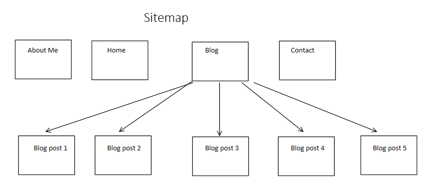

Each of the main pages of the site can be accessed from anywhere using the navbar on the top of each page. Additionally, five full blog posts can be accessed from the Blogs page.

### **Screenshots**

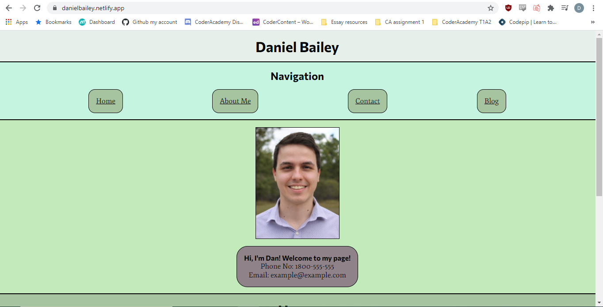

The generic top that is applied to each webpage.

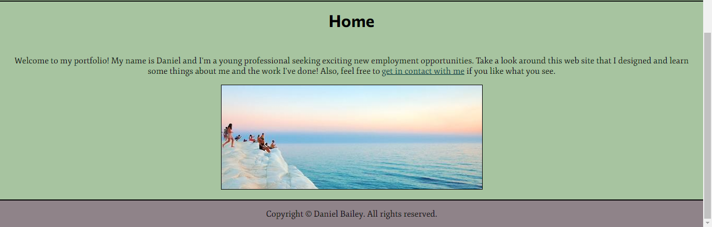

The content of the Homepage.

A demonstration of the blurb animation. Note the slightly changed background colour.

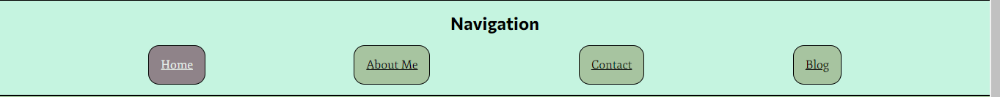

A demonstration of the colour change that occurs when mousing over one of the navigation buttons.

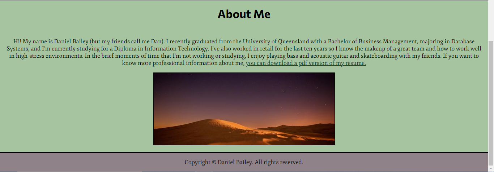

Contents of About Me page.

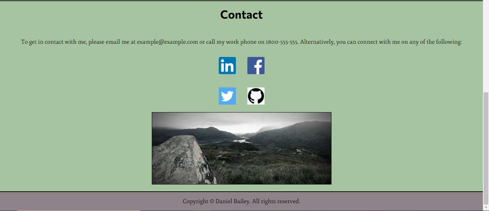

Contents of Contact page.

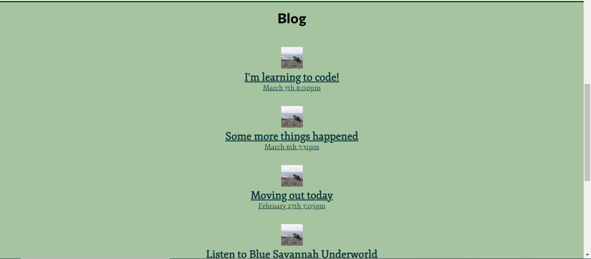

The top half of the contents of the Blog page.

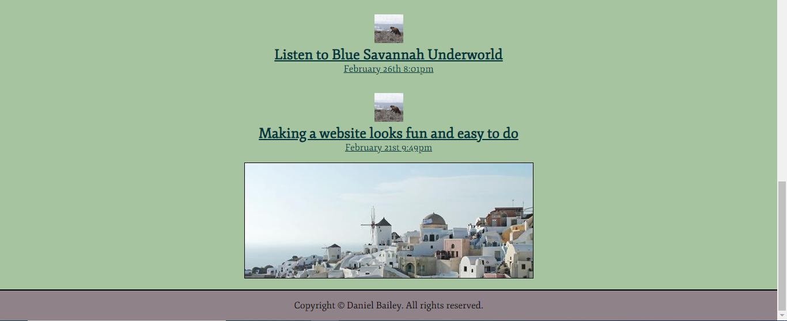

The bottom half of the contents of the Blog page.

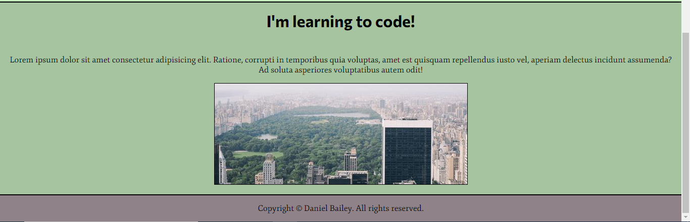

An example blog post, accessed from the Blog page.

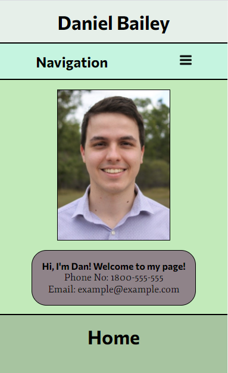

The top of the Homepage, shown on the mobile version.

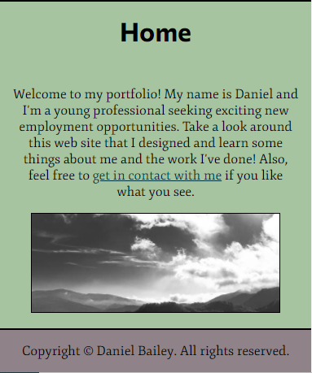

The bottom of the Homepage, shown on the mobile version.

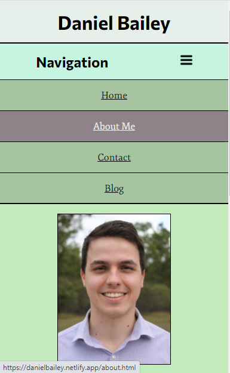

Demonstration of the drop-down navigation menu, which occurs on mobile.

### **Target Audience**

There are three target audiences who will/may view my portfolio assignment:
1. The educators at Coder Academy, who will assess the code and style of this portfolio and assign me marks accordingly.
1. Potential employers outside the field of programming, who will use this website to gain an insight into the kind of person I am, my education and employment history, and whether I will fit in at their workplace.
1. Potential employers within the field of programming, who will do the above but will also view my website through a programmer's lens: They will judge my programming ability based on what I have demonstrated in the construction of the site itself.

### **Tech Stack**

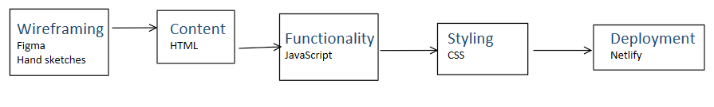

Figma was used in this assignment to create wireframes for my website. When Figma proved cumbersome to control and navigate, I resorted to hand-drawn sketches for my wireframes. I have used HTML documents with a small amount of Javascript to provide content and functionality for my website, and CSS to apply stylings to these HTML documents. Additionally, Netlify was used to deploy my website because of it's ease of use.